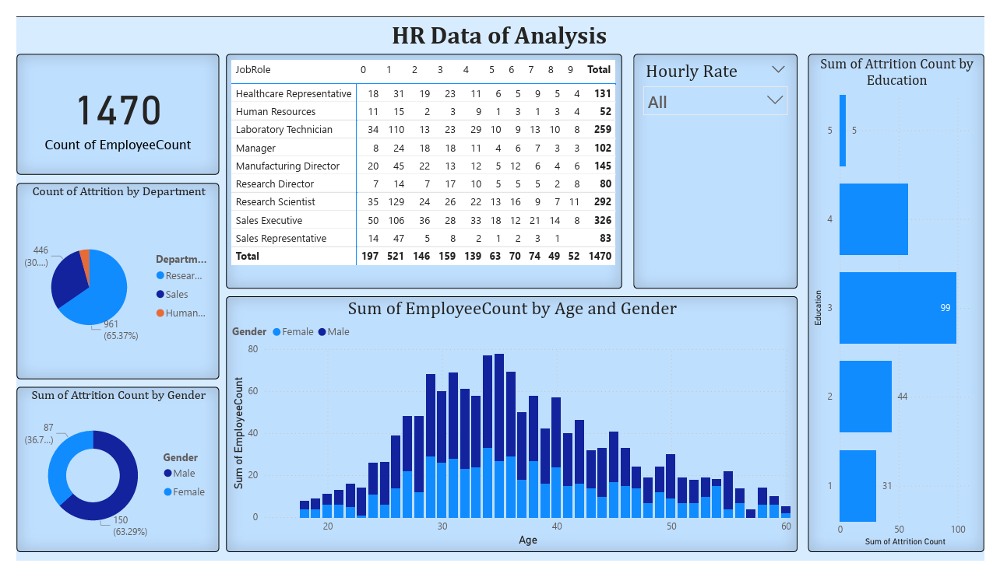

# HR Attrition Analysis Dashboard

### Live Dashboard Screenshot

## Project Overview

This project involves the creation of an interactive dashboard in Power BI to analyze HR data for a company with 1,470 employees. The primary objective is to identify key factors driving employee attrition and to provide a clear overview of the company's workforce composition.

## Data Source

The dataset used for this analysis is [here](https://github.com/sriks023/Power-BI-HR-Attrition-Analysis/blob/main/HR%20Analytics%20Data_Exp11%20(2).csv). It contains employee information such as job role, age, gender, education level, and attrition status.

## Tools Used

* **Power BI:** For data modelling, analysis, and dashboard creation.
* **Microsoft Excel:** For initial data cleaning and preparation (if applicable).

### 📈 Dashboard Interpretation & Key Insights

Here is a detailed breakdown of the findings from the HR analysis dashboard.

#### **Overall Workforce Summary**
* **Total Employees**: The company has a total of 1,470 employees.
* **Gender Distribution**: The `Sum of EmployeeCount by Age and Gender` chart indicates that male employees represent a larger portion of the workforce Within the group of employees who left, males (150) outnumber females (87).
* **Age Distribution**: The largest concentration of employees appears to be in the 30 to 40 age range, with the distribution peaking around age 35.

#### **Job Roles & Departments**
* **Largest Departments**: The most populous job roles are "Sales Executive" with 326 employees, "Research Scientist" with 292 employees, and "Laboratory Technician" with 259 employees.
* **Smallest Departments**: The job roles with the fewest employees are "Human Resources" with 52 employees and "Research Director" with 80 employees.

#### **Attrition Analysis**
* **Overall Attrition**: The total attrition count is 237 employees.
* **Attrition by Gender**: Males account for 63.29% of total attrition (150 employees), while females account for the remaining 36.71% (87 employees).
* **Attrition by Education Level**: The data reveals a significant trend where employees with **Education Level '3'** have the highest number of attritions at 99. The next highest groups are Education Level '2' with 44 attritions and Education Level '1' with 31 attritions. This suggests a potential retention problem for employees with these specific education backgrounds, particularly level 3.

## How To Use

1.  Download the repository files.
2.  Ensure you have Power BI Desktop installed.
3.  Open the `HR-Analysis-Dashboard.pbix` file to interact with the live dashboard and explore the data model.
